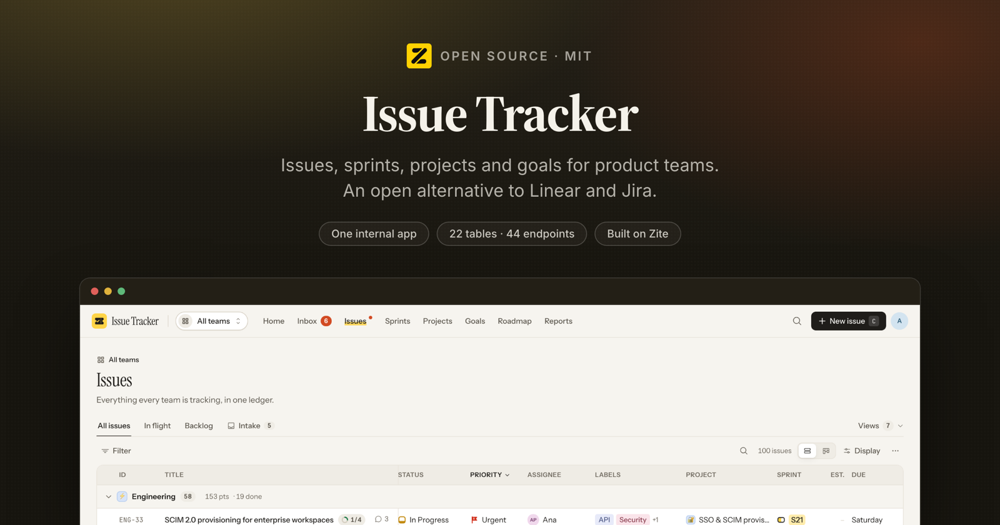
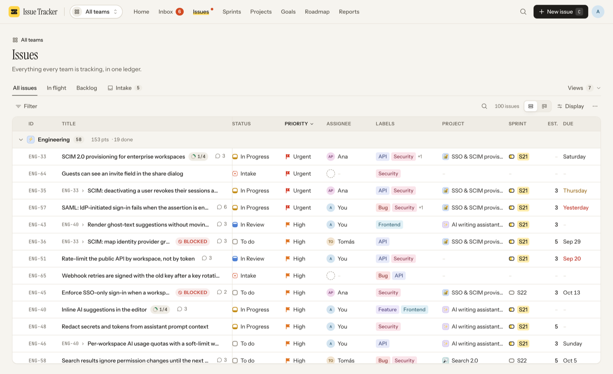
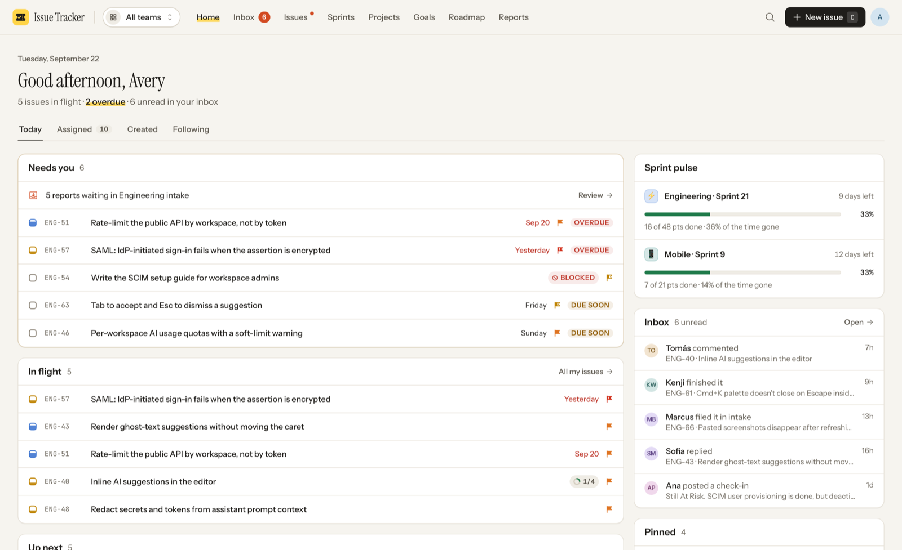

<p align="center">
  
</p>

<h3 align="center">Issue Tracker</h3>

<p align="center">
  Open-source issue tracking: issues, sprints, projects, goals and roadmap.
  <br/>
  An open alternative to <b>Linear</b> and <b>Jira</b>.
</p>

<p align="center">
  <a href="#how-its-organised">Features</a> ·
  <a href="#install-it-in-your-own-workspace">Install</a> ·
  <a href="#how-it-works">How it works</a> ·
  <a href="#local-development">Development</a> ·
  <a href="DESIGN.md">Design brief</a>
</p>

<p align="center">
  <a href="LICENSE"></a>
  <a href="https://github.com/zite/issue-tracker/stargazers"></a>
  <a href="https://www.npmjs.com/package/zitejs"></a>
</p>

---

## What this is

An issue tracker for product teams with its own point of view: paper, ink and a
highlighter; a real ledger instead of a feed; issues that open beside the list
instead of replacing it; an intake that asks for one decision at a time.

This is a **Zite solution**, meaning a workspace you install into your own
[Zite](https://zite.com) account and then edit. Zite provides the Postgres
database, the endpoint runtime, auth and hosting. Everything above that is the
~43,000 lines of TypeScript in this repository.

Everything a team needs is here: intake, issues, sprints with burndowns,
projects with milestones and check-ins, goals, a roadmap, saved views, an inbox,
reports, settings with roles, and six AI assists that degrade gracefully when no
AI is attached.

A fresh install starts empty, with one team (Engineering, key `ENG`) so the first
issue can be filed straight away. To look around first, an admin can load sample
data from **Settings → General**: a fictional product company with 3 teams, 110
issues, 9 sprints and 9 projects. It is only offered while the workspace has no
work in it, and there is no one-click way to remove it, so load it into a
workspace you are using to try the app.

The design language is documented in [DESIGN.md](DESIGN.md), which is worth
reading before changing any UI.

<p align="center">
  
</p>

---

## How it's organised

**One top bar, not a sidebar.** Home · Inbox · Issues · Sprints · Projects ·
Goals · Roadmap · Reports, plus search, New issue and your account.

**Team scope, not team trees.** A switcher next to the logo scopes Issues,
Intake, Sprints, Projects, Roadmap and Reports to one team or all of them. The
scope is the first segment of those URLs (`/eng/issues`, `/all/sprints`) and
`[` / `]` cycle through it.

| Surface | What it does |
| --- | --- |
| **Home** | Today: what needs you (overdue, blocked, due soon, intake waiting), what's in flight, up next, sprint pulse per team, recent inbox, pins. Tabs for everything assigned to, created by, or followed by you. |
| **Inbox** | A two-pane reader grouped by day. Events about one issue fold into one line. Done / unread / snooze; `J` `K` `E` `U` `⇧H`. |
| **Issues** | The ledger: a real table with sortable column headers, group bands and cells you edit in place, or a board with drag-and-drop lanes. Tabs for all, in flight, backlog and intake, and a saved-views menu. |
| **Intake** | A review deck. One report at a time with who sent it, what it says and whether something similar already exists; decide with `1` accept, `2` accept and plan, `3` duplicate, `4` decline (with a reason), `→` skip. |
| **Issue** | Opens in a sheet beside any list (J/K keep walking), or as a full page. Serif title, a "ticket stub" of editable facts, Markdown description, breakdown (sub-issues, with AI suggestions), links, relations, and a discussion where runs of history fold into one line. |
| **Sprints** | Per team: current-sprint scoreboard with the goal as a pull quote, up next, and a history ledger with velocity. Across teams: every team's sprint side by side. Sprint page: burndown, scope added mid-sprint, risk assessment, breakdown that narrows the issue board, and *Complete sprint* with rollover. |
| **Projects** | Gallery, table or board by status. Project page with progress over time, a milestone track, facts, contributors and a check-in feed that sets health. |
| **Goals** | Company goals with project health and rolled-up progress; goal page with its projects and a compact timeline. |
| **Roadmap** | Every dated project on one timeline, grouped by goal, team or status. Drag a bar or its edges to reschedule, with Undo. |
| **Reports** | A masthead of headline numbers (each opens the list behind it), velocity, throughput, cycle and lead time, status mix, age, workload and breakdowns. |
| **Views** | Saved filters, grouping, order and layout, for yourself, a team or everyone. |
| **Settings** | Profile and appearance, members and roles, teams (statuses editor with drag to reorder, sprints, intake, estimates), labels and templates. |

**New issue** understands quick-capture tokens in its title: `@name` assigns,
`#label` labels, `!high` sets priority, `+project` files it, `^fri` sets a due
date. It also offers templates, *Draft with AI*, and live duplicate detection.

**Keyboard first.** `⌘K` searches issues and reaches everything else: your pins,
any team's issues, intake or current sprint, and commands for the open issue.
`C` new issue, `/` search the list, `?` all shortcuts, `G` then `H` `M` `N` `I`
`T` `S` `P` `O` `R` `E` `V` to jump, and `S` `P` `A` `L` `I` `⇧P` `⇧S` `⇧D` `⇧E`
`⇧T` on issues and selections. `/#/eng/sprints/current` always opens that
team's running sprint, which makes it a good bookmark.

Light and dark themes, and usable on a phone.

---

<p align="center">
  
</p>

---

## Install it in your own workspace

Zite apps are built by pointing a coding agent at the platform over MCP, and
installing one works the same way.

**1. Connect the Zite MCP server to your agent.**

```bash
claude mcp add --transport http zite https://mcp.zite.com/mcp
```

(Cursor, VS Code and any other MCP client work the same way. See
[the Zite quickstart](https://developers.zite.com/quickstart).)

**2. Give it this prompt.**

> Install https://github.com/zite/issue-tracker into a new Zite workspace.
>
> 1. `create_workspace` named "Issue Tracker", then `create_sandbox` on it.
> 2. In the sandbox, add this repo as a git remote and check its files out over
>    `/workspace`, keeping the sandbox's own `zite.config.json`.
> 3. Read `zite.schema.json` and create all 22 tables with `create_table`, passing
>    each field's `definition` (`name`, `type`, `template`) straight through. Do this
>    **before** `create_app`, because `create_app` and `check_app` refresh
>    `zite.schema.json` from the live database, and would otherwise blank it.
> 4. `create_app` "Issue Tracker" (internal). That exact name produces
>    `apps/issue-tracker`, which is what this repo already uses.
> 5. Run `yarn install`, so the workspace packages are linked.
> 6. `check_app`, `commit`, then `publish_app`.

**3. Open the app.** The first person to open it becomes the admin and lands in an
empty workspace with one team, Engineering (`ENG`). Rename it under **Settings →
Teams** if it should be called something else; a team's key can't change. To try
the app with data in it first, use **Load sample data** at the bottom of
**Settings → General** before creating anything.

---

## How it works

A Zite workspace is **one database with one or more apps on top of it**. The split
that matters:

| Part | Where it runs |
| --- | --- |
| `apps/*/src/` minus `api/` | The browser. A normal Vite + React SPA. |
| `apps/*/src/api/*.ts` | Zite's endpoint runtime, server-side. One file = one endpoint. |
| `packages/*` | Imported directly. No build step; consumed as TypeScript source. |
| `.zite/` | Generated clients: typed DB access and a typed caller. Never edited by hand. |

The frontend never touches the database. It calls endpoints through a generated typed
client (`import { listIssues } from 'zitejs/api'`), and endpoints reach the database
through another (`import { zite } from 'zitejs/db'`). 44 endpoints, 18 pages.

## The data model

22 tables. `Issues` is the centre.

```
Teams ──< Statuses                   Goals ──< Projects ──< Milestones
  │  └──< Sprints                               │   └──< Check Ins
  │  └──< Labels (team or workspace)            │
  └──< Issues >─────────────────────────────────┘
         │  ├─ assignee / creator → Members ──< Team Members
         │  ├─ parent → Issues (sub-issues)
         │  ├──< Issue Labels, Issue Relations, Issue Attachments, Issue Subscribers
         │  ├──< Comments ──< Reactions
         │  └──< Activity
Notifications, Pins, Views, Issue Templates
```

### Decisions worth knowing before extending it

**Foreign keys are text columns, not `linked_record` fields.** Every list is a
filtered, sorted, grouped SQL query (`findAll` ignores `sort`), `Issues` points
at `Members` twice, and sub-issues are self-referential. Two consequences, both
handled in `src/server/`:

- **Joins cast the uuid side:** `t.id::text = i."teamId"`.
- **An unset text field is `''`, never `NULL`.** "No assignee" is
  `COALESCE(col, '') = ''`; `ref()` in `server/sql.ts` maps `''` to `null`.

**The actor comes from the session, never from the request** (`getActor`), and
**roles are enforced on the server** (`assertCan`). Settings mirrors them by
locking controls with an explanation.

| Role | Can |
| --- | --- |
| Admin | Everything, including inviting people, changing roles and deactivating members |
| Member | All work, plus teams, statuses, labels and templates |
| Guest | All work on issues, projects and sprints; can view settings but not change them |

**Rows carry ids; the client resolves names.** `listIssues` returns ids and
`bootstrap` loads every reference table once (`lib/workspace.tsx`), so an edit
is one optimistic cache write that re-renders the ledger, board and sheet at
once (`lib/mutations.ts`).

---

## Sample data

Nothing is loaded automatically. The first time `bootstrap` finds no team, it
creates Engineering (`ENG`) with the default workflow and puts everyone on it
(`src/server/setup.ts`), because an issue can't be filed without a team.
Nothing else is created.

An admin can load the sample from **Settings → General → Sample data**, which
calls `seedWorkspace`. It builds *Quillmark*, a fictional collaborative writing
app: 3 teams, 10 people, 9 projects under 3 goals, 22 milestones, 14 check-ins,
9 sprints (past, current, upcoming), 110 issues with sub-issues, relations and
links, 52 comments with replies and reactions, 429 history entries, 7 saved
views, 4 templates and an inbox. Whoever loads it is "you": they get real work
across statuses, the inbox and pins. Dates are relative to the moment it loads.

The control is shown, and `seedWorkspace` accepts the call, only while the
sample has never been loaded (no member has a `@quillmark.test` address) and
the workspace has no issues, projects, goals or sprints. It fills the existing
`ENG` team instead of adding a second one, keeps that team's name and settings
(it only fills in a blank description), reuses labels that already exist and
skips templates and views whose names are taken. There is no one-click removal.

---

## AI

Through the workspace's Anthropic connection (`src/server/ai.ts`):

| Where | What | Without AI |
| --- | --- | --- |
| New issue → **Draft with AI** | A rough note becomes a titled, described, labelled, estimated issue for review | The note becomes the title and description |
| New issue and Intake | Duplicate detection: SQL narrows by word overlap, Claude judges | Strong keyword overlap only |
| Issue → Breakdown → **Suggest** | A breakdown into sub-issues you pick from | Hidden |
| Issue → Discussion → **Catch me up** | Decisions, open questions and next steps | Hidden |
| Sprint → **Assess risk** | Names what puts the sprint at risk; the verdict itself is arithmetic | The computed verdict and flags |
| Project → **Draft with AI** | A check-in drafted from what shipped and what's in flight | A factual summary to edit |

JSON Schemas are written by hand (the SDK's zod helper needs zod v4; Zite pins
zod 3). The accepted shape is exactly `{ type: 'json_schema', schema }`.

`sendDueReminders` runs daily at 08:00 UTC and notifies assignees about work due
tomorrow or newly overdue.

---

## Local development

```bash
yarn install
cp .env.example .env.local   # then put your own workspace id in it
yarn dev                     # :8080
```

**What works offline:** the whole frontend, `tsc`, and `vite build`. Editing a
component hot-reloads.

**What does not:** the endpoints in `src/api/` execute on Zite's runtime against your
workspace database, not on your machine. `yarn dev` serves the UI, but every endpoint
call goes out to the workspace named in `.env.local` and needs a session for that
organization. There is no local database mode yet.

Run `yarn generate` after adding, renaming or deleting an endpoint.

```bash
yarn run check   # tsc + endpoint bundling + vite build
```

> **Note.** On an app this size `zitejs check` prints `bundle endpoints ✗` with no
> error and exits non-zero. That is a 1 MB stdout buffer in the checker, not a real
> failure. To see genuine endpoint errors, bundle to a file instead:
> `npx zitejs bundle --app issue-tracker > /tmp/b.json` and read `endpointErrors`.

---

## Extending it

- **A new issue property:** add the field, then `issueDto` / `ISSUE_SELECT` /
  `mapIssueRow` in `server/issues.ts`, `PATCHABLE` in `api/updateIssue.ts`,
  `TRACKED` in `server/changes.ts`, a column in `issues/IssueLedger.tsx` and a
  fact in `issue/Facts.tsx`.
- **A new filter:** `issueFilterSchema` and `buildIssueWhere` on the server, then
  `FILTERS` in `issues/filters.tsx`.
- **A new list surface:** render `<IssuesView surfaceKey baseFilters … />`; it
  owns fetching, grouping, sorting, selection, keyboard, bulk actions and views.
- **A new scoped section:** add it to `SCOPED_SECTIONS` in `lib/scope.tsx` and
  route it under `/:scope/…` in `App.tsx`.

---

## Tech stack

React 18 · TypeScript · Vite · Tailwind CSS 3 · [shadcn/ui](https://ui.shadcn.com) ·
Radix · TanStack Query & Table · Recharts · dnd-kit · date-fns · zod ·
[zitejs](https://github.com/zite/zitejs) · [Claude](https://www.anthropic.com) for
the optional AI assists.

## Contributing

Issues and pull requests are welcome. See [CONTRIBUTING.md](CONTRIBUTING.md), and
read [DESIGN.md](DESIGN.md) before changing UI. Anything security-related goes to
[SECURITY.md](SECURITY.md) instead of a public issue.

## License

MIT. See [LICENSE](LICENSE). Third-party notices in [NOTICE](NOTICE).
